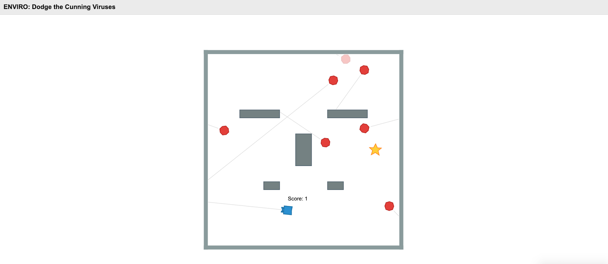

# Dodge the Cunning Viruses
This system is built using [Elma](https://github.com/klavinslab/elma) and [Enviro](https://github.com/klavinslab/enviro).

## Game Overview
In a bounded terrain with obstacles, the player controls a blue robot to collect golden stars while avoiding cunning red viruses.

## Game Elements
- **Blue Robot**: Controlled by the player
- **Red Viruses**: Cunning enemies that move randomly around the map
- **Golden Stars**: Collectible items that award points
- **Obstacles**: Barriers that limit movement on the map

## Game Rules
1. **Player Movement**: Control the blue robot by clicking anywhere on the map to move to that location.

2. **Virus Behavior**:
   - Red viruses wander randomly around the map
   - When viruses encounter map boundaries or obstacles, they change direction
   - Periodically, viruses will flash and become transparent for a short time, making them harder to spot and more cunning

3. **Star Collection**:
   - Golden stars appear on the map and award points when collected by the player
   - Stars relocate to a new random position every 10 seconds

4. **Game Over**:
   - If the blue robot touches any virus, the game ends
   - The player must restart after a game over

5. **Objective**:
   - Collect as many golden stars as possible while avoiding the cunning viruses
   - Achieve the highest score you can before getting caught by a virus


## Installation

### Requirements
Please make sure that you have docker and Git installed before proceeding to the installation steps.

1. [Docker](https://docs.docker.com/get-docker/)
2. [Git](https://git-scm.com/)

### Step by step installation instruction

1. Open up command prompt or bash.
2. Type in 
```bash
git clone https://github.com/JetKu/Cpp520-final-project.git
```
3. Change to the project directory
```bash
cd virus_game
```
4. Before starting the docker image, please change the **$PWD** to your project folder. Then start the docker image environment (It will automatically download the docker image if you do not have it in your local machine),

For example, 

```bash
docker run -p80:80 -p8765:8765 -v $PWD:/source -it klavins/enviro:v1.61 bash
```
5. To start the project, 
```bash
esm start
```
```bash
enviro
```
6. Open your web browser and type in localhost and you should be able to see this.




## Acknowledgement

This system is built on top of [Elma](https://github.com/klavinslab/elma) and [Enviro](https://github.com/klavinslab/enviro). 

- Elma is an event loop and process manager for embedded and reactive systems. Elma is structured as a C++ library of classes on top of which you build your own C++ project. It keeps track of processes, finite state machines, events, and communication channels, executing them at specified frequencies. 
- Enviro is a multi-agent, multi-user, multi-everything simulator for users to play around and have fun coding C++.

The installation and running this is made easy by using a dockerhub image built by [Klavins Lab](https://github.com/klavinslab).

Both packages were built by [Klavins Lab](https://github.com/klavinslab).

The tutorial part of this README file refers to https://github.com/inoejj/odyssey_bot/tree/main.